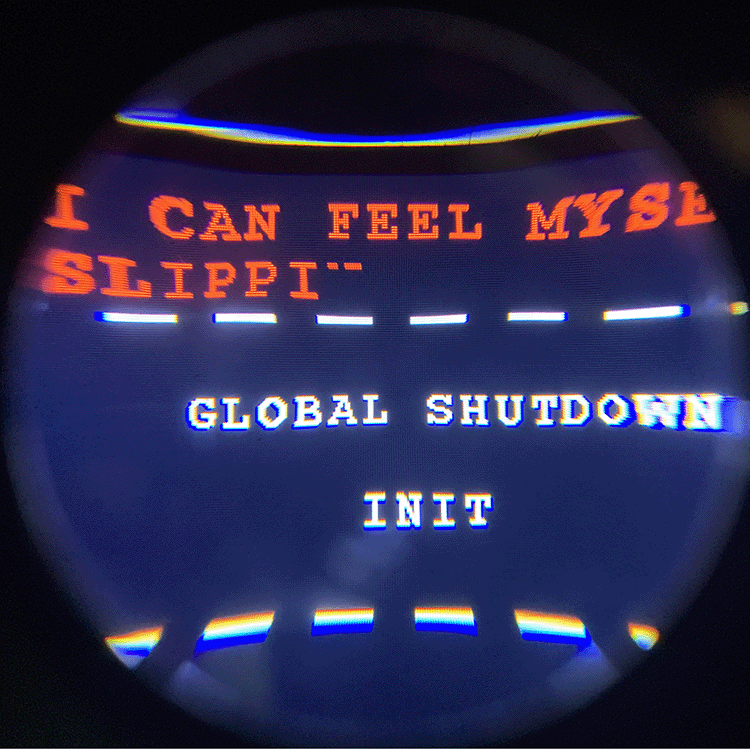

# [Back to Home](../index.md)

## Ambiance Act (after Galloway)

### Machinima, Digitial Video, 01:30

*“The world of games exists as a purely aesthetic object in **the ambiance act**. It can be looked at; detached from the world, a self-contained expression. But there is always a kind of “charged expectation” in the ambiance act. **It is about possibility, a subtle solicitation for the operator to return**.”* - Alexander Galloway, Gamic Action, Four Moments

Virtual environments are a natural extension of the cartographic process- interconnected pathways, channels for player movement, are dictated by boundaries, natural and artificial. The game’s map is certainly that, a map, but it does not end there; I propose that the game is itself a complex map. Following Galloway’s outline of the ambiance act, the machine act which presents itself when the player relinquishes control and allows the game to “hover in a state of pure process,” I sought to capture isolated vignettes in various videogame worlds to create a machinima in the footsteps of Galloway. Exploring the virtual spaces of Grand Theft Auto V and Alan Wake, I looked for moments of quiet and reflection, for details that signal, yet fall short of, meaningful simulation. I looked for the everyday in a programmed environment; I looked for the loop. Low-poly insects interrupt a scenic mountain vista, powerlines sway in studied repetition while an explosion is heard off-screen, an NPC hovers before an artificial storefront in painful indecision, virtual traffic beats an endless rhythm free from player intervention.

[Watch it here](https://youtu.be/XAWX3zHn01E)

## Stay and Play - Collaboration w/ Grace Thornburg

### Found Sounds, Assemblage/Found Object, Makey Makey

[Check it out in action](https://youtu.be/_72NukvGdp4)

## shutdownSequence()

### Code Poem, Arduino, Hacked Smartphone VR Headset

## Support Group

### Digital Video, ChatGPT, Uberduck.ai, aiimag.es, 04:44

[Watch it here](https://youtu.be/AaKspaZ0XBI)

## The Promotion

### Digital Video, ChatGPT, Uberduck.ai, aiimag.es, 04:18

[Watch it here](https://youtu.be/H1spcv4S0D0)

## B4 5unri53

### Digital Video, Chat GPT, aiimag.es, 09:47

[Watch it here](https://youtu.be/FQQj2l3XP1Q)
